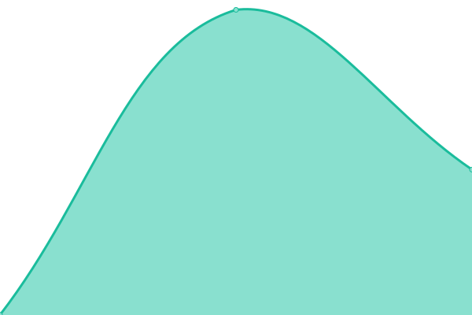
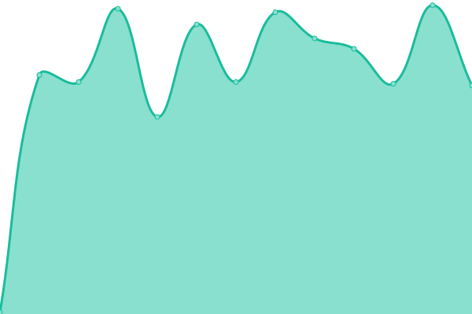
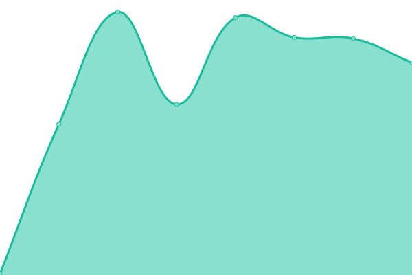

# [📈 Live Status](https://status.katacode.fr): <!--live status--> **🟧 Partial outage**

This repository contains the open-source uptime monitor and status page for [mattdigital-dev](https://status.katacode.fr), powered by [Upptime](https://github.com/upptime/upptime).

With [Upptime](https://upptime.js.org), you can get your own unlimited and free uptime monitor and status page, powered entirely by a GitHub repository. We use [Issues](https://github.com/mattdigital-dev/katacode-status/issues) as incident reports, [Actions](https://github.com/mattdigital-dev/katacode-status/actions) as uptime monitors, and [Pages](https://status.katacode.fr) for the status page.

<!--start: status pages-->
<!-- This summary is generated by Upptime (https://github.com/upptime/upptime) -->
<!-- Do not edit this manually, your changes will be overwritten -->
<!-- prettier-ignore -->
| URL | Status | History | Response Time | Uptime |
| --- | ------ | ------- | ------------- | ------ |
|  [🌐 Web Platform](https://katacode.fr) | 🟩 Up | [web-platform.yml](https://github.com/mattdigital-dev/katacode-status/commits/HEAD/history/web-platform.yml) | 

 1976ms
     
 | 

<a href="https://status.katacode.fr/history/web-platform">100.00%</a>
    

|  [⚡ API](https://api.katacode.fr/api/health) | 🟩 Up | [api.yml](https://github.com/mattdigital-dev/katacode-status/commits/HEAD/history/api.yml) | 

 1619ms
     
 | 

<a href="https://status.katacode.fr/history/api">9.80%</a>
    

|  [🔐 Auth](https://api.katacode.fr/api/health/auth) | 🟩 Up | [auth.yml](https://github.com/mattdigital-dev/katacode-status/commits/HEAD/history/auth.yml) | 

 251ms
     
 | 

<a href="https://status.katacode.fr/history/auth">97.93%</a>
    

|  [🗄️ Database](https://api.katacode.fr/api/health/database) | 🟩 Up | [database.yml](https://github.com/mattdigital-dev/katacode-status/commits/HEAD/history/database.yml) | 

 250ms
     
 | 

<a href="https://status.katacode.fr/history/database">97.93%</a>
    

|  [🚀 Redis](https://api.katacode.fr/api/health/redis) | 🟩 Up | [redis.yml](https://github.com/mattdigital-dev/katacode-status/commits/HEAD/history/redis.yml) | 

 143ms
     
 | 

<a href="https://status.katacode.fr/history/redis">97.93%</a>
    

|  [📦 Storage (S3)](https://api.katacode.fr/api/health/s3) | 🟥 Down | [storage-s3.yml](https://github.com/mattdigital-dev/katacode-status/commits/HEAD/history/storage-s3.yml) | 

 177ms
     
 | 

<a href="https://status.katacode.fr/history/storage-s3">0.00%</a>
    

<!--end: status pages-->

[**Visit our status website →**](https://status.katacode.fr)

## 📄 License

- Powered by: [Upptime](https://github.com/upptime/upptime)
- Code: [MIT](./LICENSE) © [Anand Chowdhary](https://anandchowdhary.com), supported by [Pabio](https://pabio.com)
- Data in the `./history` directory: [Open Database License](https://opendatacommons.org/licenses/odbl/1-0/)
